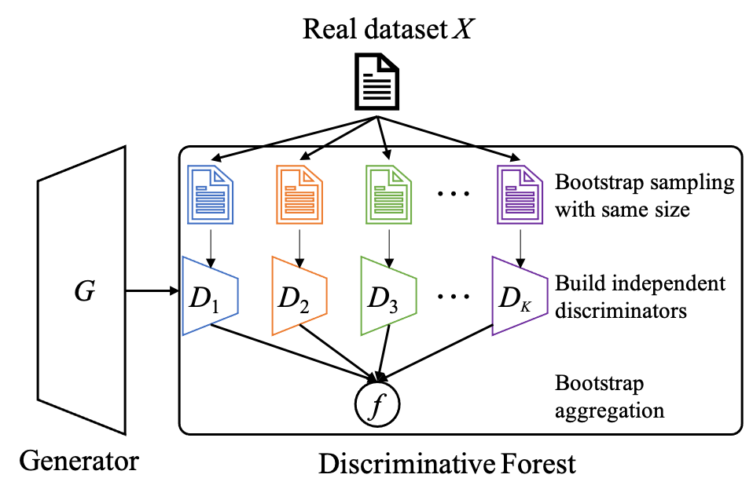

### 📋 Forest-GAN: Discriminative Forests Improve Generative Diversity for Generative Adversarial Networks

## Abstract
&nbsp;&nbsp;&nbsp;&nbsp; Improving the diversity of Artificial Intelligence Generated Content (AIGC) is one of the fundamental problems in the theory of generative models such as generative adversarial networks (GANs). Previous studies have demonstrated that the discriminator in GANs should have high capacity and robustness to achieve the diversity of generated data. However, a discriminator with high capacity tends to overfit and guide the generator toward collapsed equilibrium. In this study, we propose a novel discriminative forest GAN, named Forest-GAN, that replaces the discriminator to improve the capacity and robustness for modeling statistics in real-world data distribution. A discriminative forest is composed of multiple independent discriminators built on bootstrapped data. We prove that a discriminative forest has a generalization error bound, which is determined by the strength of individual discriminators and the correlations among them. Hence, a discriminative forest can provide very large capacity without any risk of overfitting, which subsequently improves the generative diversity. With the discriminative forest framework, we significantly improved the performance of AutoGAN with a new record FID of 19.27 from 30.71 on STL10 and improved the performance of StyleGAN2-ADA with a new record FID of 6.87 from 9.22 on LSUN-cat.

## Citation
"Discriminative Forests Improve Generative Diversity for Generative Adversarial Networks.", Chen J*, Li J, Song C*, Li B*, Chen Q, Gao H, Wang H, and Shi X, In Proceedings of the 38th AAAI Conference on Artificial Intelligence (AAAI 2024), Vancouver, Canada, February 20-27, 2024.
